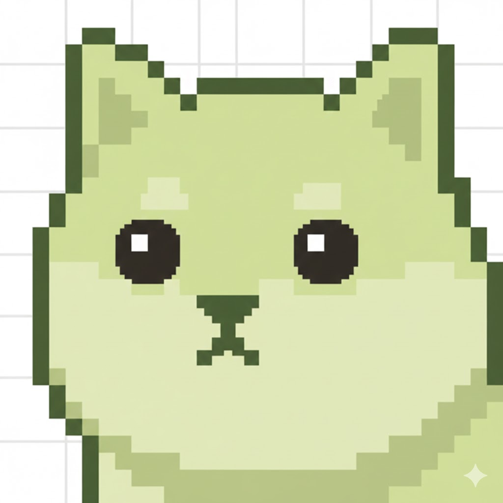

# my-shiba 開発の軌跡 🐕

## プロジェクト概要

GitHub の「草（Contribution Graph）」を Slack に投稿する Bot を、完全 AI ペアプログラミングで作成したプロジェクトです。

## きっかけ

- GitHub の草を Slack で手軽に確認したい
- 毎日のコーディング習慣を維持したい
- 「@my-shiba check」と打つだけで草が見られたら最高！

## 開発の流れ

### Phase 1: 計画と技術選定

**やったこと**:
- 技術スタックの選定（Cloudflare Workers + Hono + TypeScript）
- GitHub 草画像取得方法の調査
- Slack API の調査

**決定事項**:
- ランタイム: Cloudflare Workers（無料枠が広い）
- フレームワーク: Hono（軽量で高速）
- 言語: TypeScript

### Phase 2: 初期実装

**実装した機能**:
- Hono で HTTP エンドポイント作成
- Slack Event Subscriptions のハンドリング
- GitHub 草画像の URL 取得

**ここまでは順調！**

## 技術的な課題と解決の軌跡

### Challenge 1: `invalid_blocks` エラー

**問題**:
```
Error: invalid_blocks
```

Slack の `chat.postMessage` API で画像を表示しようとしたが、SVG URL が Blocks API でサポートされていなかった。

**試したこと**:
1. ❌ Image blocks で SVG URL → `invalid_blocks`
2. ❌ Attachments で SVG URL → 画像として表示されない

**解決策**:
ファイルアップロード方式（`files.uploadV2`）に変更することを決定。
→ メリット：過去のスナップショットが Slack に保存される！

### Challenge 2: `invalid_arguments` エラー（第1弾）

**問題**:
```  
Error: Failed to get upload URL: invalid_arguments
Response: missing required field: length, filename
```

`files.getUploadURLExternal` が `filename` と `length` を受け取っていない。

**原因**:
`Blob.size` が正しく送信されていなかった。

**解決策**:
```typescript
// Before: Blob
const imageBlob = await imageResponse.blob();
const fileSize = imageBlob.size; // これが送信されていなかった

// After: ArrayBuffer
const imageArrayBuffer = await imageResponse.arrayBuffer();
const fileSize = imageArrayBuffer.byteLength; // 確実に取得
```

### Challenge 3: `invalid_arguments` エラー（第2弾）

**問題**:
```
Error: Failed to get upload URL: invalid_arguments
Warning: missing_charset
```

パラメータは送信しているのに、Slack API が受け取っていない。

**原因**:
Slack API は `application/x-www-form-urlencoded` を期待しているのに、JSON で送信していた。

**解決策**:
```typescript
// Before: JSON
headers: { 'Content-Type': 'application/json' },
body: JSON.stringify({ filename, length })

// After: URLSearchParams
headers: { 'Content-Type': 'application/x-www-form-urlencoded' },
body: new URLSearchParams({ filename, length: length.toString() })
```

**これで動いた！** → と思ったら...

### Challenge 4: SVG テキストが表示される問題

**問題**:
ファイルはアップロードされるが、SVG のテキスト（マークアップ）がそのまま表示される。


**原因**:
Slack の `files.uploadV2` は SVG を画像としてレンダリングしない。
サポートされるのは PNG、JPG、JPEG、GIF のみ。

**試行錯誤**:
1. ❌ ファイル拡張子を `.svg` に変更 → 効果なし
2. ❌ PNG を返す GitHub 草 API を探す → 全て SVG だった
   - `github-readme-stats.vercel.app` → SVG
   - `ghchart.rshah.org` → SVG
   - `github-readme-activity-graph` → SVG
   - `grass-graph.vercel.app` → text/plain
   - `github-contributions-img` → HTML

**結論**: SVG → PNG 変換を自前で実装する必要がある！

### Challenge 5: SVG → PNG 変換の実装

#### 試行 1: `@resvg/resvg-js`

**問題**:
```
ERROR: Could not resolve "fs"
ERROR: No loader is configured for ".node" files
```

Node.js のネイティブバインディングを使用するため、Cloudflare Workers では動作しない。

#### 試行 2: `svg2png-wasm`（動的 WASM 読み込み）

**実装**:
```typescript
const wasmUrl = 'https://unpkg.com/svg2png-wasm@1.4.1/svg2png_wasm_bg.wasm';
const wasmBuffer = await fetch(wasmUrl).arrayBuffer();
await initialize(wasmBuffer);
```

**問題**:
```
CompileError: WebAssembly.instantiate(): 
Wasm code generation disallowed by embedder
```

Cloudflare Workers は動的な WASM 読み込みを禁止している。

#### 試行 3: 外部スクリーンショットサービス

**実装**:
```typescript
const pngUrl = `https://image.thum.io/get/width/1200/crop/800/${svgUrl}`;
```

**ユーザーフィードバック**:
> 「外部サービスに頼るのは大仰だと思うんだよな。npm ライブラリで解決できないの？」

**その通り！** シンプルさが重要。

#### 試行 4: `@resvg/resvg-wasm`（静的 import）✅

**発見**:
Cloudflare Workers の ES モジュールは、WASM モジュールを直接 import できる！

**最終実装**:
```typescript
import { initWasm, Resvg } from '@resvg/resvg-wasm';
import resvgWasm from '@resvg/resvg-wasm/index_bg.wasm';

// WASM を初期化
await initWasm(resvgWasm);

// SVG → PNG 変換
const resvg = new Resvg(svgText, {
    fitTo: { mode: 'width', value: 1200 },
});
const pngBuffer = resvg.render().asPng();
```

**結果**: 
- ✅ 動作した！
- ✅ 外部サービス不要
- ✅ npm ライブラリのみで完結
- ✅ 過去のスナップショットが Slack に保存される

## 最終的な実装

### アーキテクチャ

```
┌─────────────┐
│   Slack     │
│  @my-shiba  │
└──────┬──────┘
       │ app_mention event
       ▼
┌─────────────────────────────┐
│  Cloudflare Workers         │
│  (Hono + TypeScript)        │
│                             │
│  1. SVG 取得               │
│  2. PNG 変換 (resvg-wasm)  │
│  3. Slack アップロード      │
└─────────────────────────────┘
       │
       ▼
┌─────────────┐
│   Slack     │
│ PNG ファイル │
└─────────────┘
```

### コードの特徴

1. **SVG → PNG 変換**
   - `@resvg/resvg-wasm` を使用
   - WASM を静的 import
   - 高品質な変換

2. **Slack ファイルアップロード**
   - `files.uploadV2` API 使用
   - 3ステップ: Upload URL 取得 → アップロード → 完了
   - 過去のスナップショット保存

3. **Cloudflare Workers**
   - エッジで高速実行
   - 無料枠が広い
   - グローバル展開

## 学んだこと

### 技術的な学び

1. **Slack API の制約**
   - Blocks API は PNG/JPG/GIF のみサポート
   - `files.uploadV2` は form-urlencoded を期待
   - SVG は画像としてレンダリングされない

2. **Cloudflare Workers の制約**
   - Node.js ネイティブバインディング不可
   - 動的 WASM 読み込み不可
   - ES モジュールの WASM import は可能！

3. **デバッグの重要性**
   - 詳細なログ出力で問題を特定
   - Slack API のレスポンスを常に確認
   - エラーメッセージをしっかり読む

### AI ペアプログラミングの威力

1. **高速なイテレーション**
   - アイデア → 実装 → テスト → 修正のサイクルが速い
   - 複数のアプローチを短時間で試せる

2. **技術調査が効率的**
   - API ドキュメントの検索
   - ライブラリの比較
   - 代替案の提示

3. **コード品質**
   - TypeScript の型定義
   - エラーハンドリング
   - ログ出力

## 開発統計

### プロジェクト全体
- **総開発時間**: 約2時間（アイデア → 完成 → GitHubリポジトリ公開まで）
- **試行錯誤回数**: 10回以上
- **使用したAPI**: 6種類以上を検証
- **最終的なバンドルサイズ**: 2.5MB（WASM含む）
- **デプロイ回数**: 15回以上

### アイコン制作
- **制作時間**: 約30分
- **使用ツール**: 生成AI
- **制作者**: デザイナーの妻
- **コンセプト**: ピクセルアートの柴犬 × 芝生（草）

## まとめ

完全 AI ペアプログラミングで、以下を実現しました：

✅ アイデアから実装まで一貫した開発
✅ 複数の技術的課題を解決
✅ 高品質なコードとドキュメント
✅ CI/CD パイプラインまで構築

**何より楽しかった！**

雑に作り始めて、問題に直面して、解決策を見つけて、また問題に直面して...
このプロセスが非常に楽しく、学びも多かったです。

AI にざっくりとした要望を伝えるだけで、ちゃんと動くものがシュッと作れる。
これがモダンな開発体験だと実感しました。

## クレジット

### 名前とアイコン

- **名前**: @gatchan0807 が命名
  - 「豆しば」のパロディで、「芝生（草）やし」という意味も込められています
  - GitHub の「草」とかけた完璧なネーミング
  
- **アイコン**: デザイナーの妻が制作 💚
  - **制作時間**: わずか30分！生成AIを駆使したピクセルアート
  - **コンセプト**: 芝生を育てる柴犬のイメージ
  - **スタイル**: レトロで可愛いピクセルアート

<p align="center">
  
</p>

名前とビジュアルの両方が揃って、プロジェクトに命が吹き込まれました！

### タイムライン

- **アイコン制作**: 30分（生成AI活用）
- **プロジェクト実装**: 約2時間（アイデア → 完成 → GitHub公開）
- **合計**: たった2時間半で完全に動作するSlack Botが完成！

これが生成AIを活用したモダンな開発のスピード感です 🚀

---

**Next**: Issue や PR で機能追加していくのも面白そう！
- コマンドパラメータ対応
- 複数ユーザー対応
- 定期自動投稿
- 統計情報表示
